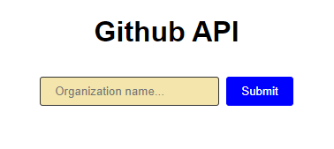
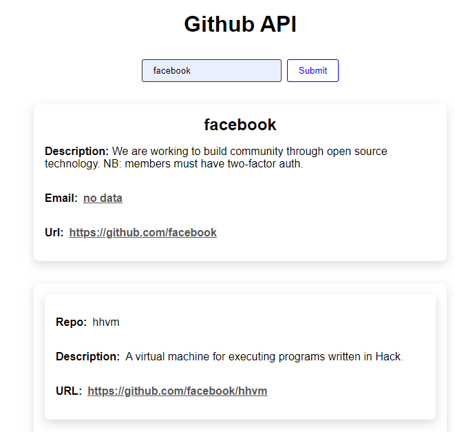
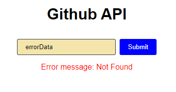

#GitHub Organisation Finder 

- Built using Vanilla JavaScript, HTML and SASS
- Data extract with GitHub API
- This app searches for a GitHub organization and displays basic information about that organization and its repositories

